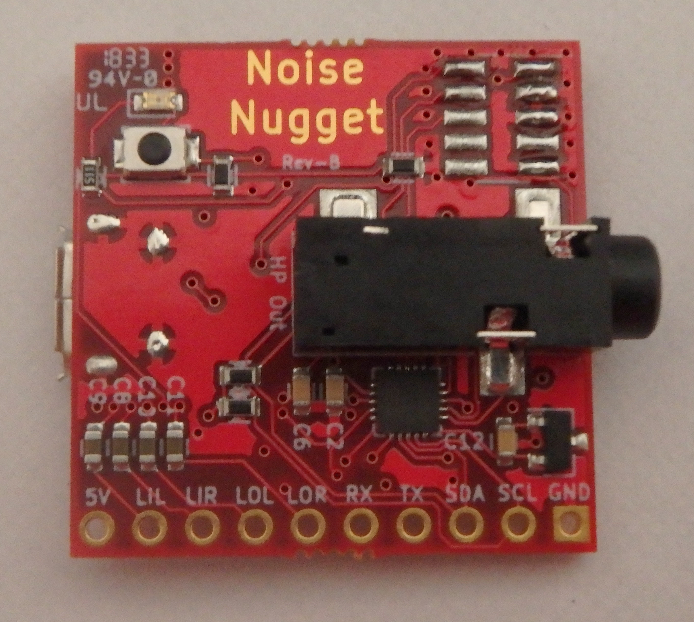

# noise-nugget
Square Inch music widget

Noise Nugget is a compact digital synthesizer based on an 180MHz Cortex-M4 and
quality audio DAC with headphone amplifier.

My goal with this project is to create a little "Swiss Army knife" of audio
synthesis. Packing the maximum features on the smallest and cheapest board.

With all its connectivity (USB, 2 x audio out, 1 x audio in, I2C, UART, GPIOs)
it can be used for many different tasks:
 - Digital synthesizer, with a MIDI interface or some other means of control
 - Audio effects, for a guitar pedal or synthesizer (delay, reverb, distortion)
 - Audio FX trigger board, playing pre-recorded sounds
 - Audio playback, recording sounds from the input and then playing it back at
   the push of a button
 - USB sound interface

So far I implemented one audio effect, a MIDI over USB synth and sampler. Noise
Nugget is a compact digital synthesizer based on an 180MHz Cortex-M4 and
quality audio DAC with headphone amplifier.

My goal with this project is to create a little "Swiss Army knife" of audio
synthesis. Packing the maximum features on the smallest and cheapest board.

With all its connectivity (USB, 2 x audio out, 1 x audio in, I2C, UART, GPIOs)
it can be used for many different tasks:
- Digital synthesizer, with a MIDI interface or some other means of control
- Audio effects, for a guitar pedal or synthesizer (delay, reverb, distortion)
- Audio FX trigger board, playing pre-recorded sounds
- Audio playback, recording sounds from the input and then playing it back at
  the push of a button
- USB sound interface

So far I implemented one audio effect, a MIDI over USB synth and sampler.
